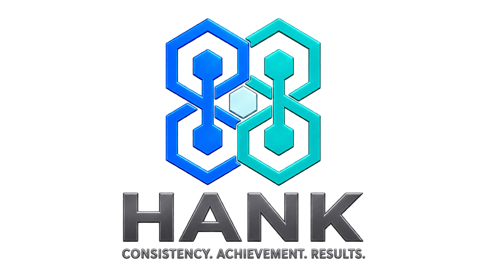
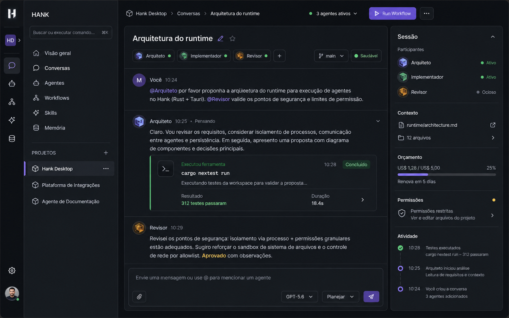

<div align="center">

  

  <br />

  **Plataforma desktop multiagente orientada a governança, autonomia controlada e alta performance.**

  <br />

  [](https://www.rust-lang.org/)
  [](https://v2.tauri.app/)
  [](https://react.dev/)
  [](https://www.typescriptlang.org/)
  [](https://sqlite.org/)
  [](LICENSE)

</div>

---

## Prévia da Aplicação

<div align="center">
  
</div>

---

<!-- HANK_PLAN_PROGRESS:START -->
## Progresso do plano

**Cobertura observada:** 375/414 IDs do plano têm PR mergeada · 91%

`██████████████████░░`

- Última PR de trabalho mergeada: `#389 · 2026-08-31T07:52:25Z`
- IDs do plano sem PR correspondente: `39 · primeira PR-010`
- Próximo card sem correspondência: `PR-010`
- PRs mergeadas sem card correspondente: `0`
- Fonte: `.planning/queue/queue-*.md` e PRs mergeadas no GitHub.
- Nota: a barra mede correspondência de integração por ID; PRs fora da fila devem declarar `Plan card: none` e a conclusão continua dependente da prova/ledger do plano.
<!-- HANK_PLAN_PROGRESS:END -->

---

## Visão Geral

**Hank** é uma plataforma desktop para orquestração e execução de agentes autônomos de IA, combinando a segurança e o desempenho de um **core modular em Rust** com a leveza e flexibilidade de uma interface **React 19** encapsulada via **Tauri 2**.

Diferente de orquestradores convencionais que executam chamadas de LLM sem salvaguardas estritas, o Hank foi desenhado desde a base com **limites de arquitetura**, **políticas de orçamento (budgeting)**, **permissões granulares de ferramentas** e **governança de autonomia** para garantir que cada ação executada pelos agentes seja determinística, auditável e segura.

---

## Funcionalidades

- **Governança e Políticas de Autonomia**: Definição clara de níveis de autonomia para cada agente (somente leitura, execução supervisionada com confirmação ou autônomo controlado).
- **Controle e Política de Orçamento**: Limites estritos de consumo de tokens e custos financeiros por sessão, agente ou projeto, prevenindo gastos imprevistos.
- **Gerenciamento e Isolamento de Projetos**: Organização em workspaces isolados com controle de repositórios, pastas e arquivos acessíveis.
- **Arquitetura Modular em Rust**: Desacoplamento total entre o domínio (`agent-core`), contratos/protocolo (`agent-protocol`), infraestrutura/runtime (`agent-runtime`) e adaptadores de interface.
- **Persistência Local e Rápida**: Armazenamento embarcado SQLite através de migrações automáticas e queries tipadas via SQLx.
- **Barramento de Eventos (Event Bus)**: Rastreabilidade completa de ações, eventos de ciclo de vida e notificações em tempo real para a interface gráfica.
- **Interface Moderna e Reativa**: Frontend desenvolvido em React 19, Vite e TypeScript integrado nativamente com a bridge de comandos e eventos do Tauri 2.

---

## Arquitetura do Sistema

O Hank segue uma arquitetura hexagonal com limites estritos entre camadas:

```text
       ┌──────────────────────────────────────────────────┐
       │             UI Adapters (Tauri / CLI)            │
       └────────────────────────┬─────────────────────────┘
                                │
                                ▼
       ┌──────────────────────────────────────────────────┐
       │                 application-api                  │
       └────────────────────────┬─────────────────────────┘
                                │
                                ▼
       ┌──────────────────────────────────────────────────┐
       │                    agent-core                    │ <── [Infrastructure Adapters]
       └────────────────────────▲─────────────────────────┘
                                │
                                │
       ┌────────────────────────┴─────────────────────────┐
       │                  agent-runtime                   │
       └──────────────────────────────────────────────────┘
```

### Divisão dos Módulos (Crates & Apps)

| Módulo | Tipo | Descrição |
| --- | --- | --- |
| [`crates/agent-core`](file:///crates/agent-core) | Rust Library | Regras de domínio puras, entidades de projetos, agentes, sessões, políticas de autonomia e limites orçamentários. |
| [`crates/agent-protocol`](file:///crates/agent-protocol) | Rust Library | Contratos de dados, envelopes de eventos, identificadores tipados e esquemas de interoperabilidade. |
| [`crates/agent-runtime`](file:///crates/agent-runtime) | Rust Library | Gerenciador do ciclo de vida de execução, barramento de eventos, persistência SQLite e serviços de aplicação. |
| [`crates/test-support`](file:///crates/test-support) | Rust Library | Utilitários de fixtures, fakes determinísticos e suporte a testes de integração. |
| [`crates/xtask`](file:///crates/xtask) | CLI / Tooling | Ferramentas de automação e tarefas auxiliares de desenvolvimento no workspace. |
| [`apps/desktop`](file:///apps/desktop) | Tauri v2 App | Shell nativo desktop responsável pela janela do sistema operacional e ponte de comunicação. |
| [`frontend`](file:///frontend) | React 19 + Vite | Interface web SPA reativa contendo a gestão de projetos, configurações e monitoramento de execuções. |

---

## Como Executar

### Pré-requisitos

Antes de iniciar, certifique-se de possuir em seu ambiente:

1. **[Rust & Cargo](https://www.rust-lang.org/tools/install)** (edição 2021 ou superior)
2. **[Node.js](https://nodejs.org/)** (v18+) e **npm**
3. Dependências de compilação do **[Tauri v2](https://v2.tauri.app/start/prerequisites/)** para o seu sistema operacional.

### 1. Clonagem do Repositório

```bash
git clone https://github.com/stoltembergg-png/hank.git
cd hank
```

### 2. Instalação de Dependências

```bash
cd frontend
npm install
cd ..
```

### 3. Execução em Desenvolvimento

Para rodar a aplicação desktop com hot-reload no frontend:

```bash
# A partir do diretório frontend:
cd frontend
npm run tauri dev
```

Ou execute separadamente o servidor Vite caso deseje testar apenas a interface web:

```bash
cd frontend
npm run dev
```

---

## Testes e Qualidade

O projeto conta com suítes automatizadas cobrindo testes unitários, testes de integração de contratos de arquitetura e testes do frontend:

```bash
# Executar toda a suíte integrada (Node contracts, Rust workspace, Vitest e Tauri):
node tools/run-all-tests.mjs

# Executar apenas testes do workspace Rust:
cargo test --workspace --locked

# Executar testes unitários do frontend:
cd frontend && npm run test
```

---

## Estrutura do Projeto

```text
hank/
├── apps/
│   └── desktop/          # Configurações e código de inicialização Tauri v2
├── crates/
│   ├── agent-core/       # Regras de domínio e lógica de agentes
│   ├── agent-protocol/   # Contratos, esquemas e eventos
│   ├── agent-runtime/    # Serviços de execução, banco SQLite e event bus
│   ├── test-support/     # Utilitários para testes
│   └── xtask/            # Tasks e ferramentas do workspace
├── docs/                 # Documentação de arquitetura, políticas e ADRs
├── frontend/             # Interface em React 19 + TypeScript + Vite
├── migrations/           # Migrações SQL do banco de dados SQLite
├── tools/                # Scripts de validação de contratos, CI e testes
├── Hank.png              # Captura de tela / preview da aplicação
├── name.png              # Logotipo / Identidade visual do Hank
├── Cargo.toml            # Configuração do Workspace Rust
└── README.md             # Documentação principal do repositório
```

---

## Governança e Diretrizes

Para detalhes específicos sobre a arquitetura e governança de agentes, consulte os seguintes documentos:

- [Arquitetura e Limites de Camadas](file:///ARCHITECTURE.md)
- [Governança de Agentes de IA](file:///AI_AGENT_GOVERNANCE.md)
- [Política de Autonomia de Agentes](file:///docs/autonomy-policy.md)
- [Política e Gestão Orçamentária](file:///docs/budget-policy.md)
- [Guia de Contribuição](file:///CONTRIBUTING.md)

---

## Licença

Distribuído sob as licenças **MIT** ou **Apache-2.0**. Consulte o arquivo de licença correspondente para obter mais detalhes.
